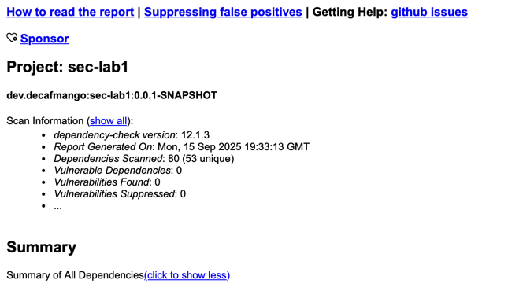

## Работа 1: Разработка защищенного REST API с интеграцией CI/CD

---

### Выполнил:

- Студент: Разинкин Александр Владимирович
- Группа: P3407
- Язык программирования: Java/Spring Boot

--- 

### Описание проекта и API

Данный проект описывает простую предметную область, в которой участвуют две сущности:

- Пользователь (User) - описывает пользователя, взаимодействующего с системой;
- Пост (Post) - описывает контент, создаваемый пользователем.

Данные сущности связаны отношение Один-ко-Многим:

- У пользователя может быть 0 или более постов;
- У поста должен быть один пользователь (т.н. автор).

Для описания API используется язык спецификации OpenAPI:

```openapi
openapi: 3.0.0

info:
  title: 'Работа 1: Разработка защищенного REST API с интеграцией CI/CD'
  version: 1.0.0

paths:
  /auth/sign-up:
    post:
      summary: 'Запрос на регистрацию пользователя'
      requestBody:
        content:
          application/json:
            schema:
              $ref: '#/components/schemas/SignInRequest'
      responses:
        201:
          description: 'Успешная регистрация пользователя'
          content:
            application/json:
              schema:
                $ref: '#/components/schemas/JwtAuthenticationResponse'
        400:
          description: 'Переданы невалидные данные'
          content:
            application/json:
              schema:
                $ref: '#/components/schemas/ExceptionDto'
  /api/users:
    get:
      summary: 'Запрос на получение всех пользователей'
      security:
        - BearerAuth: []
      responses:
        200:
          description: 'Список всех пользователей'
          content:
            application/json:
              schema:
                type: array
                items:
                  $ref: '#/components/schemas/UserDto'
  /api/posts:
    get:
      summary: 'Запрос на получение постов пользователя'
      description: 'На запрос возврашается список постов пользователя, который отправил данный запрос'
      security:
        - BearerAuth: [ ]
      responses:
        200:
          description: 'Список постов пользователя'
          content:
            application/json:
              schema:
                type: array
                items:
                  $ref: '#/components/schemas/PostDto'
    post:
      summary: 'Запрос на создание поста от пользователя'
      security:
        - BearerAuth: [ ]
      responses:
        200:
          description: 'Успешное создание поста'
          content:
            application/json:
              schema:
                $ref: '#/components/schemas/PostDto'
        400:
          description: 'Переданы невалидные данные'
          content:
            application/json:
              schema:
                $ref: '#/components/schemas/ExceptionDto'
components:
  securitySchemes:
    BearerAuth:
      type: http
      scheme: bearer
      bearerFormat: JWT
      description: 'JWT для аутентификации'
  schemas:
    SignUpRequest:
      description: 'Запрос на регистрацию пользователя'
      type: object
      required:
        - email
        - password
        - nickname
      properties:
        email:
          type: string
          format: email
          example: example@example.com
        password:
          type: string
          minLength: 6
          maxLength: 32
          example: password
        nickname:
          type: string
          minLength: 6
          maxLength: 32
          example: nickname
    SignInRequest:
      description: 'Запрос на вход пользователя'
      type: object
      required:
        - email
        - password
      properties:
        email:
          type: string
          format: email
          example: example@example.com
        password:
          type: string
          minLength: 6
          maxLength: 32
          example: password
    JwtAuthenticationResponse:
      description: 'Ответ, содержащий JWT'
      type: object
      required:
        - jwt
      properties:
        jwt:
          type: string
    UserDto:
      description: 'Пользователь'
      type: object
      required:
        - email
        - password
      properties:
        email:
          type: string
          format: email
          example: example@example.com
        password:
          type: string
          minLength: 6
          maxLength: 32
          example: password
    PostDto:
      description: 'Пост'
      type: object
      required:
        - content
      properties:
        content:
          type: string
          minLength: 1
          example: content
    ExceptionDto:
      description: 'Ответ, содержащий ошибку'
      type: object
      required:
        - message
```

### Подробное описание реализованных мер защиты

#### Защита от SQL Injection:

Для обращения к базе данных используются средства стартера spring-boot-starter-data-jpa:3.5.5 и встроенный в данный 
стартер ORM Hibernate 6.6.26.Final
  - query-методы:
    ```java
    @Repository
    public interface UserRepository extends JpaRepository<User, Long> {
    
        User findByEmail(String email);
    
    }
    ```
  - стандартный метод save:
    ```java
    @Transactional
    public PostDto createPost(PostDto postDto) {
        String email = ((User) SecurityContextHolder.getContext().getAuthentication().getPrincipal()).getEmail();
        User user = userRepository.findByEmail(email);

        Post post = Post.builder()
                .content(postDto.getContent())
                .user(user)
                .build();

        postRepository.save(post);
        return postDto;
    }
    ```

За счет того, что "под капотом" используются Prepared Statements, наше приложение защищено от SQL Injection.

#### Защита от XSS:

Для защиты от XSS используются средства стартера spring-boot-starter-security:3.5.5:
  - Используется OWASP Java HTML санитайзер, который преобразует входные значения к безопасному виду
(заменяет спецсимволы, удаляет теги и т.д.):
    ```java
    private static final PolicyFactory POLICY = Sanitizers.FORMATTING.and(Sanitizers.LINKS);

    private String sanitize(String input) {
        return POLICY.sanitize(input);
    }
    ```
  - Для большей уверенности были включены политики безопасности контента (Content-Security-Policy; CSP), которые
указывают бразуерам безопасные истоничники, откуда можно загружать ресурсы (скрипты, стили, изображения):
    ```java
    contentSecurityPolicy(
      csp -> csp.policyDirectives("script-src 'self'; " +
                                            "style-src 'self'; " +
                                            "img-src: 'self'")
    )
    ```

#### Как реализована аутентификация:

Аутентификация реализована при помощи стартера spring-boot-starter-security:3.5.5 с использованием JWT. Ключ подписи и 
время жизни, выраженное в секундах, передаются через конфигуграцию application.yml:
```yml
security:
  token:
    signing-key: ${TOKEN-SIGNING-KEY}
    tll-seconds: 600
```
Подпись осуществляется алгоритмом HS256. Пароли пользователей хэшируются алгоритмом bcrypt.

Получение токена реализовано через эндпоинты /auth/sign-up /auth/sign-in. Для аутентификации пользователя по jwt
испольуется middleware JwtAuthenticationFilter, где производится:
- Проверка целостности токена
- Проверка срока годности токена
- Заполнение обновление SpringSecurityContext-а

В случае, если JWT валиден, запрос пользователя пропускается далее, иначе возвращется ошибка 403.

### Скриншоты CI/CD


